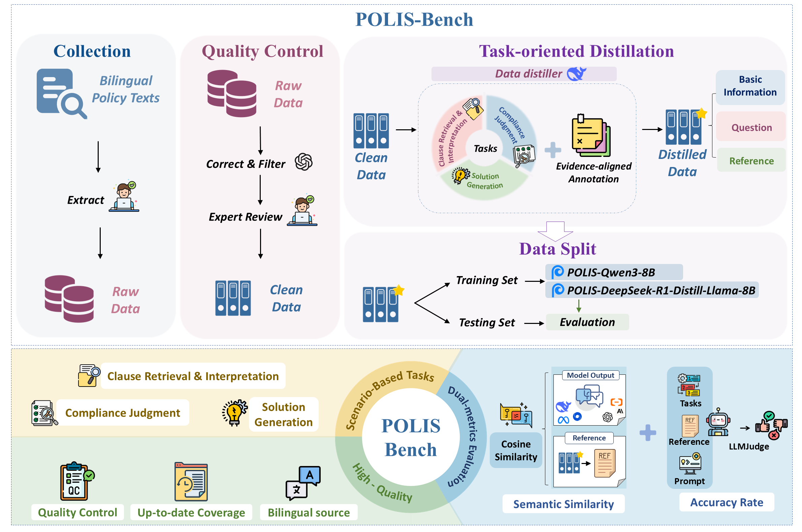

#  POLIS-Bench

<p align="center">
  <a href="https://arxiv.org/abs/2511.04705">
    
  </a>
  
  
  
  
  
</p>

> A benchmark for multilingual policy QA — from dataset preparation to evaluation, without exposing private prompts or raw policy documents.

## Table of Contents
- [Overview](#overview)
- [Directory Map](#directory-map)
- [Quick Start](#quick-start)
  - [1. Environment](#1-environment)
  - [2. Dataset Preparation](#2-dataset-preparation)
  - [3. Fine-Tuning](#3-fine-tuning)
  - [4. Inference & Evaluation](#4-inference--evaluation)
- [Command Cheat Sheet](#command-cheat-sheet)
- [Visualization](#visualization)
- [Dataset & Privacy](#dataset--privacy)
- [Contributing](#contributing)
- [License](#license)

## Overview
- Multilingual coverage: curated Chinese (`CN`) and English (`EN`) policy scenarios.
- End-to-end pipeline: reproducible scripts for data prep, LoRA fine-tuning, inference, judging and aggregation.
- Modular design: every step lives in its own directory and CLI, making it easy to swap models or plug into existing infra.
  
  
  
## Directory Map

| Path | Description |
| ---- | ----------- |
| `configs/` | LoRA fine-tuning templates for DeepSeek-R1 and Qwen3 models (LLaMA-Factory compatible). |
| `datasets/` | Output folder for derived JSONL files (filtered corpus, splits, prompted data, etc.). |
| `evaluation/` | Metric utilities: semantic similarity, LLM-as-a-judge, and aggregation scripts. |
| `finetuning/` | Dataset preparation helpers that consolidate the original one-off scripts. |
| `inference/` | Batch inference helper targeting OpenAI-compatible endpoints. |
| `POLIS_dataset/` | Released train/test splits and distilled corpus used in the paper. |


## Quick Start

### 1. Environment

```bash
conda create -n polis-bench python=3.10 -y
conda activate polis-bench
pip install -r requirements.txt
```

Essential packages: `tqdm`, `numpy`, `pandas`, `sentence-transformers`, `scikit-learn`, `matplotlib`, `openai` (>=1.0).

### 2. Dataset Preparation

`datasets/train.jsonl` and `datasets/test.jsonl` are already split. Use the helper CLI to
clean legacy fields and attach the SFT prompt:

```bash
# Normalise field names (e.g., fix ",language" -> "language")
python finetuning/prepare_dataset.py normalize \
  --input datasets/train.jsonl \
  --output datasets/train_clean.jsonl
python finetuning/prepare_dataset.py normalize \
  --input datasets/test.jsonl \
  --output datasets/test_clean.jsonl

# Attach the instruction-style prompt used for SFT
python finetuning/prepare_dataset.py format \
  --input datasets/train_clean.jsonl \
  --output datasets/train_prompted.jsonl
python finetuning/prepare_dataset.py format \
  --input datasets/test_clean.jsonl \
  --output datasets/test_prompted.jsonl
```

The `format` subcommand accepts `--template`, `--text-field`, and `--question-field`
flags if you need to customise the prompt template or source column names.

### 3. Fine-Tuning

LoRA configs are ready to plug into [LLaMA-Factory](https://github.com/hiyouga/LLaMA-Factory). Update the model/dataset paths and launch:

```bash
llama_factory-cli train configs/ds_llama3_lora_sft.yaml
```

Checkpoints are saved under `./outputs/` by default.

### 4. Inference & Evaluation

Run inference against any OpenAI-compatible endpoint:

```bash
python inference/run_inference.py \
  --input POLIS_dataset/test_set/test.jsonl \
  --output results/deepseek_predictions.jsonl \
  --failed results/deepseek_failed.jsonl \
  --model deepseek-r1-distill-llama-8b \
  --base-url http://localhost:8000/v1 \
  --api-key YOUR_KEY
```

Then score and summarize:

```bash
# Semantic similarity scoring
python evaluation/semantic_similarity.py \
  --input results/deepseek_predictions.jsonl \
  --output results/semantic_scores

# LLM-as-a-judge
python evaluation/llm_judge.py \
  --input results/semantic_scores \
  --output results/llm_judge \
  --failed results/llm_judge_failed \
  --base-url https://api.example.com/v1 \
  --api-key your-api-key \
  --model my-judge-model

# Aggregate CSV reports
python evaluation/aggregate_results.py \
  --input results/llm_judge \
  --output results/aggregated
```

## Command Cheat Sheet

| Stage | Command | Purpose |
| ----- | ------- | ------- |
| Prompting | `prepare_dataset.py format` | Attach SFT prompt template. |
| Fine-tune | `llama_factory-cli train ...` | Launch LoRA training via LLaMA-Factory. |
| Inference | `run_inference.py` | Batch prompts to an OpenAI-compatible API. |
| Similarity | `semantic_similarity.py` | Cosine similarity with multilingual embeddings. |
| LLM Judge | `llm_judge.py` | Binary correctness labels via configurable judge. |
| Aggregation | `aggregate_results.py` | Summaries by model, language, task. |


## Dataset & Privacy
- `POLIS_dataset/` ships with distilled data and the exact splits used in our experiments.
- Original policy documents and prompts remain private. Use the scripts in this repo to generate any derived artifacts you need.

## Citation
If you find POLIS-Bench useful in your work, please cite:

```
@misc{yang2025polisbenchmultidimensionalevaluationllms,
      title={POLIS-Bench: Towards Multi-Dimensional Evaluation of LLMs for Bilingual Policy Tasks in Governmental Scenarios},
      author={Tingyue Yang and Junchi Yao and Yuhui Guo and Chang Liu},
      year={2025},
      eprint={2511.04705},
      archivePrefix={arXiv},
      primaryClass={cs.CL},
      url={https://arxiv.org/abs/2511.04705},
}
```


